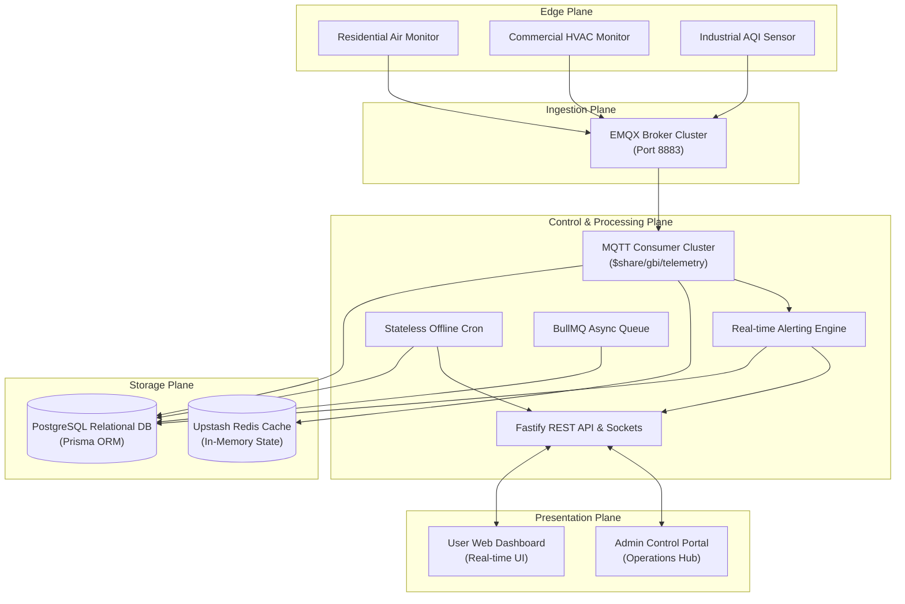

# GBI Air Quality Monitor IoT Platform – End-to-End System Architecture

This document provides a comprehensive, production-grade architectural blueprint of the GBI Air Quality Monitoring platform. It is designed to be accessible to non-technical stakeholders (Product Managers, Executives, Operations Leads) while delivering complete technical precision for Engineering Leads, DevOps Architects, and Developers.

---

## 1. Executive Summary & Platform Vision

The GBI Air Quality Monitor platform is an enterprise-grade IoT (Internet of Things) ecosystem designed to capture, process, analyze, and visualize real-time environmental data. The system monitors critical air quality metrics—such as **PM2.5, PM10, CO2, TVOC (Volatile Organic Compounds), Temperature, Humidity, Noise levels, and overall AQI (Air Quality Index)**—from physical hardware deployed across residential, commercial, and industrial locations.

### The Non-Technical View: How It Works
Imagine thousands of physical sensors deployed in offices and homes acting as "digital noses." Every few seconds, these sensors take a deep breath, analyze the air, and package that information into a secure digital envelope. They instantly mail this envelope over the internet to our central "post office" (the MQTT Broker). 

Our central processing engine (the Backend Cluster) catches these envelopes, double-checks them to prevent duplicates, files the data into a high-speed digital library (PostgreSQL database and Redis cache), and instantly broadcasts the live readings to screens around work. If the air in a specific room becomes unhealthy, the system automatically sounds the alarm—sending instant mobile notifications, logging the safety breach, and dispatching warning emails before anyone even notices a change in air quality.

```
+--------------------+      +---------------------+      +---------------------+      +--------------------+
|  IoT Edge Sensors  | ---> | MQTT Message Broker | ---> |  Backend Cluster    | ---> | Frontend Web App & |
| (Digital Noses)    |      | (Central Post Office|      | (Processing Engine) |      | Admin Control Plane|
+--------------------+      +---------------------+      +---------------------+      +--------------------+
```

---

## 2. High-Level System Architecture

The platform is structured into five distinct architectural planes:
1. **The Edge Plane (Hardware & Sensors):** IoT devices capturing physical metrics.
2. **The Ingestion Plane (Message Broker):** EMQX MQTT broker cluster handling high-frequency telemetry streams.
3. **The Control & Processing Plane (Backend API & Queues):** NestJS cluster executing business logic, threshold evaluation, and background task processing.
4. **The Storage Plane (Databases & Cache):** PostgreSQL (relational source of truth) and Redis (in-memory state cache and job queue store).
5. **The Presentation Plane (Frontend Portals):** Next.js App Router applications providing intuitive dashboards for end-users and a commanding control center for system administrators.



---

## 3. Hardware to MQTT Layer (The Edge & Ingestion Plane)

### 3.1. IoT Hardware Sensors
Physical devices deployed in the field are equipped with precision environmental sensors. Devices authenticate securely with the message broker using unique device credentials and TLS/SSL encryption. Every device possesses a factory-assigned `deviceId` (e.g., `GBI-DEV-001`).

### 3.2. MQTT Transmission & Payload Structure
Hardware devices publish telemetry packets at configured intervals (e.g., every 30 to 60 seconds) to designated MQTT topics: `telemetry/{deviceId}`. To ensure robust delivery over unstable wireless networks, devices publish using **QoS 1 (At Least Once Delivery)**.

```json
{
  "messageId": "msg-uuid-9821-4b2a",
  "deviceId": "GBI-DEV-001",
  "timestamp": "2026-05-18T12:00:00.000Z",
  "pm25": 14,
  "pm10": 22,
  "tvoc": 310,
  "co2": 450,
  "temperature": 23.5,
  "humidity": 48.2,
  "noise": 35,
  "aqi": 38
}
```

### 3.3. EMQX Broker & Shared Subscriptions
Instead of each backend server independently subscribing to all device topics (which would result in duplicate processing), the platform utilizes **EMQX Shared Subscriptions** (`$share/gbi_backend/telemetry`).
- **Horizontal Load Balancing:** When a device publishes a payload, EMQX routes that single payload to exactly one active backend worker node in a round-robin fashion. If backend traffic doubles, we simply spin up more backend containers; the broker automatically balances the load among them.
- **Clean Sessions (`clean: true`):** If a backend container crashes, the broker instantly drops its session queue and redistributes incoming messages to surviving nodes, preventing stale telemetry queues from backing up.

---

## 4. Backend Architecture & Core Services (Control & Processing Plane)

The backend is engineered for extreme concurrency, strict data validation, and ultra-low latency. It is built on **NestJS (v11)** paired with the **Fastify HTTP adapter** (delivering up to 3x higher throughput than standard Express).

### 4.1. Idempotent Ingestion Engine
Because MQTT QoS 1 guarantees "at least once" delivery, network stutters can cause the broker to redeliver the exact same packet. The backend ingestion engine is engineered to be **strictly idempotent** (processing identical data twice results in exactly one database operation).
1. **Atomic Validation:** Incoming packets are validated against strict Data Transfer Objects (DTOs).
2. **Composite Uniqueness:** The database schema enforces a strict composite unique constraint on `@@unique([deviceId, messageId, timestamp])`.
3. **P2002 Duplicate Shield:** If a duplicate packet arrives, Prisma throws a `P2002` error. The consumer catches this gracefully, logs a trace, and aborts before executing expensive cache or alert operations.
4. **Transactional Safety:** Inserting the telemetry record and updating the device's status and `lastHeartbeatAt` timestamp are wrapped inside an atomic `prisma.$transaction`. Either all updates succeed perfectly, or nothing is written.

### 4.2. Database & Data Modeling (`prisma/schema.prisma`)
The system uses PostgreSQL as its primary relational engine.
- **Strict Enums:** Device status is governed by a native database ENUM (`ACTIVE`, `WARNING`, `OFFLINE`). The database engine physically rejects invalid string mutations.
- **Optimized Time-Series Indexing:** To support blazing-fast historical queries across millions of rows, `DeviceTelemetry` utilizes a compound primary key and index on `[deviceId, timestamp]`.
- **Relational Integrity:** Mappings like `DeviceAssignment` and `DeviceGroup` seamlessly handle multi-tenant device distribution, allowing a single hardware unit to be securely assigned, grouped, and custom-aliased by different users.

### 4.3. Redis State & Task Queues
Redis acts as the high-speed in-memory engine for real-time reads and asynchronous task orchestration.
- **Instant Snapshot Cache:** Every time a device publishes valid telemetry, the exact JSON structure is serialized and stored in Redis under the key `device:{deviceId}:latest`. When the frontend requests live dashboard metrics, the backend fetches this key in milliseconds without touching PostgreSQL.
- **Dynamic Eviction TTL:** The Redis key TTL is dynamically set to `2 * OfflineWindow`. If a device loses power and stops transmitting, its live cache organically evaporates when it is officially marked offline, preventing users from viewing perpetually stale data.
- **BullMQ Queue Management:** Heavy computational tasks (like PDF report generation or bulk Excel imports) are offloaded to BullMQ worker threads. The connection layer features specialized retry logic to protect against Upstash Redis connection limits.

### 4.4. Stateless Device Heartbeat & Lifecycle Engine
Detecting when an IoT device goes offline cannot rely on in-memory timers in a clustered backend. If Server A tracks Device 1, and Device 1's next packet is load-balanced to Server B, Server A would falsely flag the device as offline.
- **Single Source of Truth:** The backend runs a precision, stateless background cron job (`@nestjs/schedule`) every few minutes.
- **Database Lock Evaluation:** The cron executes an atomic database query evaluating `lastHeartbeatAt`. If `NOW() - (Interval * ThresholdMisses) > lastHeartbeatAt`, the device status is natively transitioned to `OFFLINE`.
- **Real-Time Broadcast:** Surviving nodes instantly catch this transition and emit an `offline` WebSocket event to connected client browsers.

### 4.5. Alerting & Trigger Evaluation Engine
When telemetry arrives, the `AlertsModule` correlates the values against user-defined boundaries (`DeviceThreshold` and `GroupThreshold`, stored as flexible JSON rules).
- **State Machine Protection (`AlertState`):** To prevent flooding a user's phone with 500 emails if CO2 hovers right at the boundary line, the engine maintains an alert state machine. Once an alert triggers, it enters a cooldown state (`lastTriggeredAt`) until the metric returns to a safe baseline.
- **Multi-Channel Dispatch:** Breaches instantly write an immutable audit record into `EventLog`, persist a user notification in `Notification`, and dispatch real-time WebSocket events and SendGrid emails.

---

## 5. Frontend Architecture & User Experience (Presentation Plane)

The frontend is built on **Next.js App Router** with **Tailwind CSS v4** and **TypeScript**, delivering a highly polished, responsive, and visually stunning user experience.

### 5.1. Design Aesthetics & UI System
- **Glassmorphism & Rich Dark Mode:** Deep charcoal surfaces (`#141414`), subtle glowing borders, and vibrant status gradients give the platform a premium, state-of-the-art aesthetic.
- **Fluid Layouts:** The interface dynamically adapts across mobile phones, iPads, and ultra-wide monitor displays.
- **Micro-Animations:** Hover transitions, pulsating status badges (Green for Active, Amber for Warning, Red for Offline), and smooth chart transitions make the dashboard feel incredibly responsive and alive.

### 5.2. Dashboard & Real-Time Telemetry Consumption
- **Memoized Metric Cards:** To ensure pristine browser performance, individual sensor cards (PM2.5, Temperature, etc.) are wrapped in `React.memo`. When new telemetry streams in over WebSockets or Server-Sent Events (SSE), only the specific cards with changed values re-render.
- **Advanced Historical Charts:** The charting interface allows seamless mouse-wheel backtracking and responsive timeline zooming. To prevent browser memory exhaustion over long date ranges (e.g., 30 days of data), the frontend requests time-bucketed averages from the backend, automatically calculating optimal data intervals.

```
+-----------------------------------------------------------------------+
| [GBI Air Quality]   Dashboard | Reports | Event Logs        [Profile] |
+-----------------------------------------------------------------------+
| Live Snapshot: Living Room Purifier  [ ONLINE ]                       |
| +------------------------+ +------------------------+ +-------------+ |
| | PM2.5: 14 ug/m3        | | CO2: 450 ppm           | | Temp: 23 C  | |
| | Status: Good  [▲ 2.5]  | | Status: Excellent      | | [ Stable ]  | |
| +------------------------+ +------------------------+ +-------------+ |
| Historical Air Quality Trends (24 Hours)                              |
| |                                   _.-'--._                          |
| |                    _.-'--._     .'        '-._                      |
| |_________________.-'        '---'              '-------------------  |
+-----------------------------------------------------------------------+
```

### 5.3. Event Logs & Advanced Filtering
The Event Logs module presents an exhaustive audit trail of all system activities, safety warnings, and hardware maintenance alerts. Users can instantly filter events by specific devices, severity categories, or search strings, with client-side debouncing and one-click CSV export.

### 5.4. Frontend Security & Route Governance
- **Next.js Middleware Interception (`middleware.ts`):** Protecting routes on the client side causes layout flashing and exposes protected JavaScript bundles to network inspectors. Our platform enforces security at the Next.js edge server layer. If an unauthenticated or restricted user attempts to access `/dashboard` or `/admin`, the middleware intercepts the request and instantly redirects them to the login portal before any HTML or JS is transmitted.
- **HttpOnly Cookie Storage:** JWT access tokens and refresh tokens are strictly stored in HttpOnly, secure cookies. Client-side JavaScript cannot access these cookies, rendering Cross-Site Scripting (XSS) token theft physically impossible.

---

## 6. Premium & Tiered Subscription Model

To support monetization, the platform incorporates a robust subscription engine capable of tiering system access and feature availability.

```
+---------------------------------------------------------------------------+
| Feature Capability       | Free Tier User          | Premium Tier User    |
+---------------------------------------------------------------------------+
| Connected Devices        | Up to 2 Devices         | Unlimited Devices    |
| Historical Data Retention| 7 Days                  | 365 Days (Full Arch) |
| Report Generation        | Standard CSV Only       | Branded PDF + CSV    |
| Alerting Channels        | In-App & Email          | + Priority SMS/WA    |
| Background Queue Priority| Standard Queue          | VIP High-Speed Queue |
| Device Grouping          | 1 Group Max             | Unlimited Groups     |
+---------------------------------------------------------------------------+
```

### 6.1. Subscription Architecture & Payments
The database maintains robust relational tracking for subscriptions (`Subscription`, `SubscriptionPlan`, `PremiumSubscription`, `PremiumHistory`).
- **Payment Gateway Integration:** Secure webhook endpoints interface directly with **Razorpay and PhonePe**. When a user completes a checkout, cryptographic signature verification ensures invoice legitimacy before upgrading the account in PostgreSQL.
- **Automated Expiry & Grace Periods:** The system tracks subscription lifecycle dates (`activationDate`, `expiryDate`). Upon expiration, automated cron workers gracefully downgrade account privileges back to the free tier while retaining historical configurations in read-only states.

---

## 7. Admin Control Plane (Operations & Governance)

The Admin Portal provides platform engineers and customer support leads with complete operational command over the entire IoT infrastructure.

```
+-----------------------------------------------------------------------+
| [GBI Admin Hub]     Devices | Users | Subscriptions | Platform Stats  |
+-----------------------------------------------------------------------+
| Platform Health: 250 Total Devices | 198 Active | 120 Registered Users|
|                                                                       |
| [ + Register Single Device ]    [ ⇪ Bulk Import via Excel (.xlsx) ]   |
|                                                                       |
| Device ID     Type           Status     Assigned User   Quick Actions |
| GBI-DEV-001   Air Monitor    ONLINE     user1@gbi.com   [Unassign] [X]|
| GBI-DEV-002   Industrial     OFFLINE    -- Unassigned --[Assign]   [X]|
+-----------------------------------------------------------------------+
```

### 7.1. Admin Security Isolation
Admin API endpoints (`/admin/*`) are cryptographically isolated from the rest of the application. They require specialized access tokens signed with a unique `ADMIN_JWT_SECRET`. Standard user tokens are physically incapable of accessing administrative operations.

### 7.2. Hardware Governance & Bulk Onboarding
- **Single & Bulk Registration:** Admins can register individual hardware units or upload complex Excel (`.xlsx`) manifests via `multipart/form-data`. The backend parses the spreadsheet, skips pre-existing serial numbers, and registers new units in bulk.
- **Forced Unassignment & Soft Deletion:** If hardware is reported stolen or returned, admins can execute forced unassignment or mark a device as deleted (`isDeleted = true`). Deleted hardware is instantly ignored by the MQTT ingestion consumer; any rogue packets transmitted by decommissioned hardware are immediately dropped at the backend gate.

### 7.3. User Governance & Instant Restriction Flow
When an administrator restricts or bans a user account via `PATCH /admin/users/:id/restrict`:
1. The database sets `isRestricted = true` on the user entity.
2. The backend instantly queries and revokes all active `RefreshToken` entries for that user ID (`revokedAt = NOW()`).
3. The next time the user's browser attempts to refresh its session or open a new socket connection, the server rejects the request with `403 Forbidden`, instantly ejecting the user from all active dashboards.

---

## 8. Reliability, Scalability & Security Guarantees

### 8.1. High Availability & Horizontal Scaling
Every layer of the platform is fully stateless and containerized via Docker. The EMQX broker cluster handles millions of concurrent MQTT connections, while the backend API cluster scales dynamically behind a load balancer. Redis handles real-time state sharing, ensuring zero session affinity requirements across backend pods.

### 8.2. Defense-in-Depth Security Guardrails
- **Payload Validation Guards:** NestJS `ValidationPipe` blocks malformed or malicious JSON payloads before they reach business logic.
- **DDoS & Scraping Protection:** `@nestjs/throttler` enforces rigorous rate limits (e.g., maximum 300 requests per 15-minute window per IP) across all public APIs.
- **CSRF Protection:** Native `CsrfMiddleware` validates all non-GET HTTP requests to protect web application sessions.
- **Database Safety:** Complete prohibition of manual DDL (`CREATE`, `ALTER`) in production. All structural evolution is strictly managed through version-controlled Prisma migrations (`npx prisma migrate dev`), eliminating schema drift.

---

## 9. Verification & Maintenance Checklist

To verify the structural integrity of the active production architecture at any time, system engineers execute the following diagnostic sequence:

1. **Verify Database Synchronization:**
   ```bash
   npx prisma migrate status
   ```
   *Expected Return:* `Database schema is up to date!`
2. **Verify Schema Shadow Compilation:**
   ```bash
   npx prisma migrate dev --name verify_live --create-only
   ```
   *Expected Return:* Completes silently in the shadow database without generating structural SQL deltas, verifying absolute parity between Prisma models and live PostgreSQL constraints.
3. **Verify Queue Health & Redis Connection Limits:**
   Check BullMQ active worker counts and verify Upstash Redis memory utilization via the admin monitoring dashboard.
