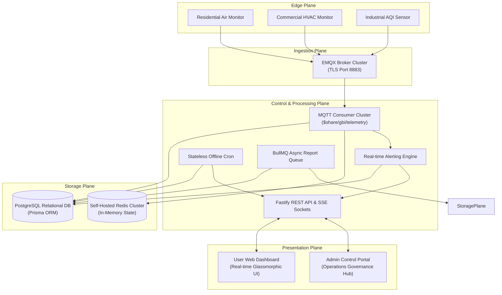
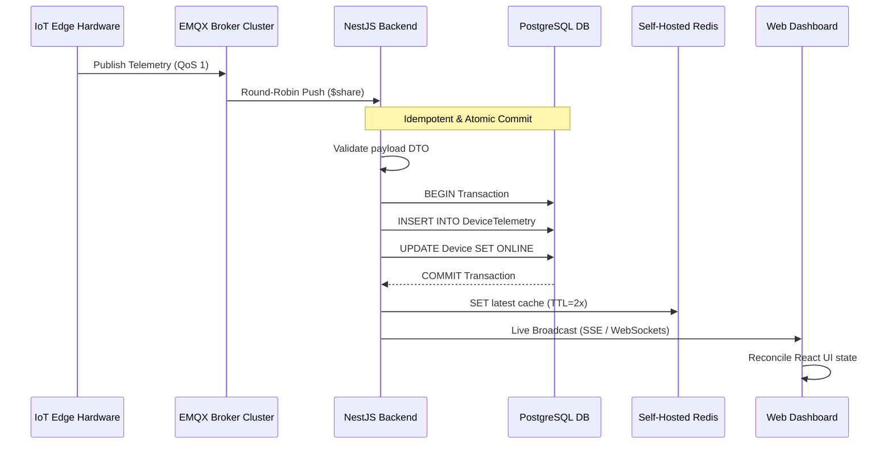
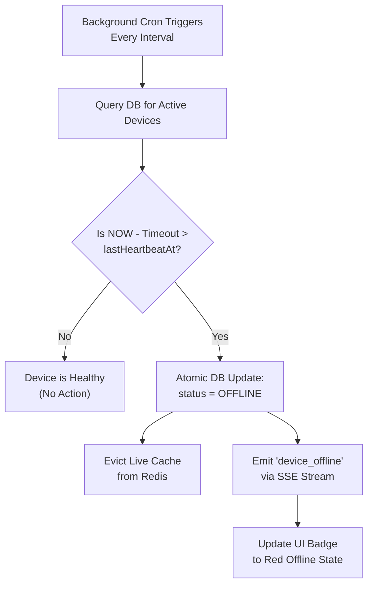
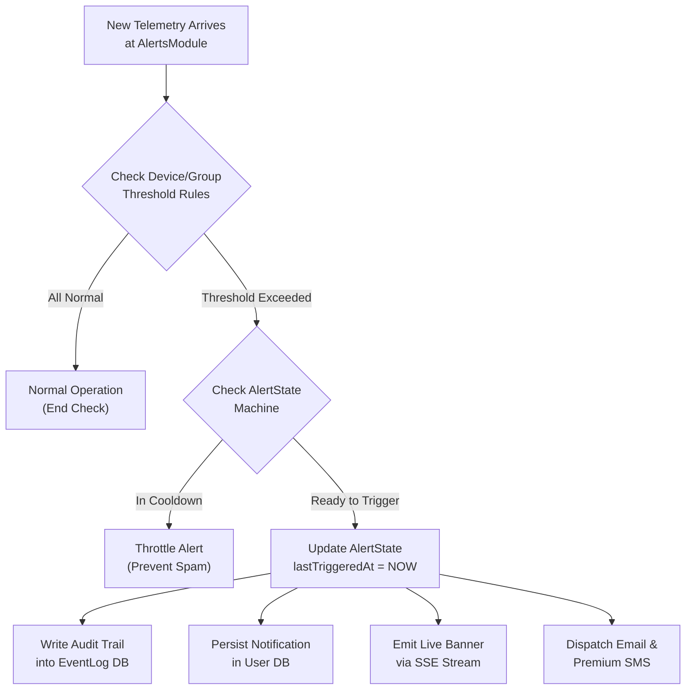
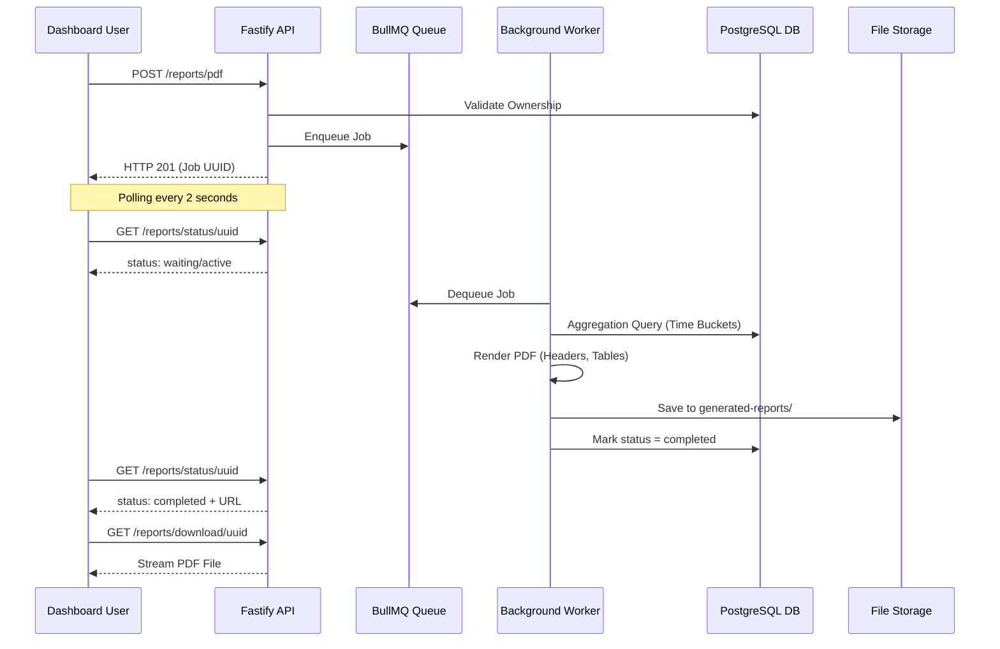
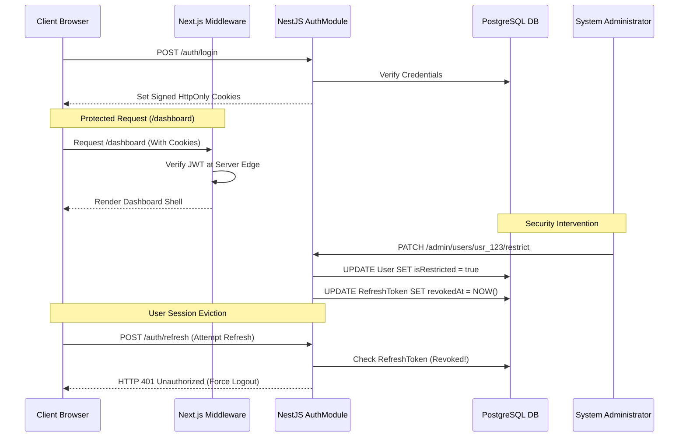

# GBI Air Quality Monitor Platform – Complete Client End-to-End System & Architecture Specification

**Document Version:** 2.2 (Production Master Specification)  
**Target Audience:** Client Executive Stakeholders, Engineering Architects, Product Managers, and Operations Leads  
**Scope:** Complete End-to-End Lifecycle, Multi-Plane Architecture, Core Operational Workflows, and Technology Stack (Frontend, Backend, Broker, Storage, Queues)

---

## 1. Executive Summary & E2E Platform Narrative

The GBI Air Quality Monitor platform is a state-of-the-art, enterprise-grade IoT (Internet of Things) ecosystem designed to continuously monitor indoor and outdoor air quality across residential complexes, commercial office towers, schools, and industrial facilities. The platform captures, processes, analyzes, and visualizes real-time environmental telemetry across eight critical parameters: **PM2.5, PM10, CO2 (Carbon Dioxide), TVOC (Volatile Organic Compounds), Temperature, Humidity, Ambient Noise, and calculated AQI (Air Quality Index)**.

### The Non-Technical End-to-End Data Journey
Imagine thousands of physical air quality monitors installed on walls across an office building acting as continuous "digital noses." Every 30 to 60 seconds, these devices sample the surrounding air with lab-grade optical and chemical sensors. They package these precise readings into a secure digital envelope, lock it with military-grade encryption, and instantly mail it over Wi-Fi to our central clearinghouse (the EMQX Message Broker).

Our high-speed processing engine (the NestJS Backend Hub) catches these incoming envelopes in milliseconds. To ensure absolute accuracy, the system performs a rigorous safety check to discard any duplicate envelopes caused by unstable Wi-Fi networks. It instantly logs the fresh numbers into a lightning-fast memory cache (Self-Hosted Enterprise Redis Cluster) and a permanent digital archive (PostgreSQL), and simultaneously streams the live metrics across the globe to user browser screens via Server-Sent Events (SSE).

If a conference room becomes stuffy and CO2 levels cross healthy boundaries, the system automatedly initiates an emergency safety protocol without human intervention. It instantly drops down a glowing red warning banner on active web dashboards via real-time SSE streams, logs an immutable audit trail, and dispatches urgent warning emails and mobile SMS notifications before occupants even notice a decline in air quality.

Simultaneously, when facility managers require long-term environmental sustainability audits (such as 30-day historical averages across multiple office floors), a dedicated background queue engine (BullMQ) time-buckets millions of data points into structured intervals, compiling beautifully branded, watermarked PDF reports that stream directly to the user's device.

```
+--------------------+      +---------------------+      +---------------------+      +--------------------+
|  IoT Edge Sensors  | ---> | EMQX Message Broker | ---> | NestJS Backend Hub  | ---> | Next.js Glassmorphic|
| (Digital Noses)    |      | (Central Clearing)  |      | (Validation & Queue)|      | Dashboard & Admin  |
+--------------------+      +---------------------+      +---------------------+      +--------------------+
```

---

## 2. Master 5-Plane E2E System Architecture

The ecosystem is architected into five decoupled, horizontally scalable operational planes, designed to handle massive concurrency while maintaining sub-second latency from hardware sampling to browser visualization.
1. **The Edge Plane (Hardware Sensors):** Physical Wi-Fi enabled environmental sensors sampling ambient air.
2. **The Ingestion Plane (Message Broker):** EMQX MQTT broker cluster accepting high-frequency SSL/TLS connections on port 8883.
3. **The Control & Processing Plane (Backend Cluster):** High-throughput NestJS (v11) Fastify micro-cluster evaluating DTOs, threshold triggers, and scheduling background workers.
4. **The Storage Plane (Database & Memory Engine):** PostgreSQL (relational source of truth via Prisma ORM) and Self-Hosted Enterprise Redis Cluster (in-memory state serialization and BullMQ job management).
5. **The Presentation Plane (Frontend Applications):** Next.js App Router providing sleek glassmorphic dashboards for end-users and a commanding control center for system administrators.



---

## 3. Stage 1 – The Edge Plane (Hardware Sampling & Security)

### 3.1. Precision Sensor Hardware
Physical devices deployed in the field are equipped with commercial-grade environmental sensors:
- **NDIR (Non-Dispersive Infrared) Sensors:** Precision tracking of Carbon Dioxide (CO2) levels.
- **Laser Scattering Particulate Optical Sensors:** High-accuracy measurement of PM2.5 and PM10 micron particles.
- **Metal-Oxide Semiconductor Sensors:** Instant detection of TVOCs (Volatile Organic Compounds).
- **Calibrated Acoustic Sensors:** Ambient decibel (noise level) tracking.

### 3.2. Secure Firmware & TLS 1.3 Encryption
Every hardware unit possesses a factory-burned cryptographic serial identifier (`deviceId`, e.g., `GBI-DEV-001`). Devices establish secure, bi-directional TLS 1.3 encrypted connections directly to the message broker over standard Wi-Fi (Port 8883), guaranteeing that sensitive environmental metrics cannot be intercepted, spoofed, or tampered with on public networks.

### 3.3. Sampling & Packet Creation
Firmware samples local sensors at configured intervals (standardized at 30 to 60 seconds). At the exact millisecond of sampling, the microcontroller generates a unique cryptographic UUID (`messageId`) and packages the telemetry into a highly structured JSON packet.

```json
{
  "messageId": "msg-uuid-9821-4b2a",
  "deviceId": "GBI-DEV-001",
  "timestamp": "2026-05-18T12:00:00.000Z",
  "pm25": 14.2,
  "pm10": 21.8,
  "tvoc": 310,
  "co2": 452,
  "temperature": 23.5,
  "humidity": 48.2,
  "noise": 35.1,
  "aqi": 38
}
```

---

## 4. Stage 2 – The Ingestion Plane (MQTT Broker & Shared Subscriptions)

### 4.1. EMQX Broker Cluster Architecture
To support 100,000+ simultaneous hardware connections without dropping packets during network traffic spikes, the platform utilizes an enterprise cluster of **EMQX MQTT Message Brokers**.

### 4.2. Quality of Service 1 (QoS 1) Guarantee
Because IoT monitors frequently operate on unstable commercial building Wi-Fi networks or cellular links, devices publish telemetry using **MQTT QoS 1 (At Least Once Delivery)**. If a Wi-Fi router drops a connection mid-transmission, the device retains the packet in local flash memory and automatically re-publishes until the EMQX broker explicitly returns a `PUBACK` (Publish Acknowledgement).

### 4.3. EMQX Shared Subscriptions (`$share/gbi_backend/telemetry`)
In traditional MQTT architectures, if ten backend servers subscribe to a device topic, all ten servers receive identical copies of every reading, causing catastrophic database collisions. GBI resolves this using **EMQX Shared Subscriptions**.
- **Round-Robin Load Distribution:** All backend worker containers subscribe to a unified shared queue (`$share/gbi_backend/telemetry`). When a hardware reading arrives at the broker, EMQX routes that exact reading to exactly one active backend worker node. If system load doubles, DevOps engineers simply spin up additional backend containers; EMQX automatically distributes incoming packets evenly among them.
- **Clean Session Pod Recovery (`clean: true`):** If a backend worker container suffers an unexpected crash, EMQX instantly detects the dropped TCP socket and re-routes incoming message queues to surviving backend nodes, ensuring zero data loss and preventing packet backlogs.

---

## 5. Stage 3 – The Control & Processing Plane (Backend & Ingestion Engine)

The backend processing cluster is engineered on **NestJS (v11)** paired with the high-performance **Fastify HTTP adapter**, delivering up to 3x higher throughput and lower memory consumption than standard Express.js servers.



### 5.1. Idempotent Transactional Ingestion Engine
Because MQTT QoS 1 guarantees "at least once" delivery, network stutters can cause the broker to redeliver an identical telemetry packet. The backend ingestion engine is engineered to be **strictly idempotent** (processing identical data ten times results in exactly one database operation).
1. **Payload DTO Validation:** Incoming JSON packets are intercepted by the `MqttConsumer` and subjected to strict TypeScript Data Transfer Object validation via NestJS `ValidationPipe`. Any malformed or unauthorized packets are immediately dropped.
2. **Composite Uniqueness Index:** The PostgreSQL database schema enforces a strict composite unique constraint on `@@unique([deviceId, messageId, timestamp])`.
3. **P2002 Exception Trapping:** If network lag caused the broker to redeliver an identical packet, inserting the record triggers a `P2002 Unique Constraint Violation` inside PostgreSQL. The backend catches this error gracefully, marks the packet as a duplicate, and halts execution before touching caches or triggering false alerts.
4. **Atomic Transactions:** Writing the telemetry row and updating the parent device's operational status (`status = ACTIVE`, `lastHeartbeatAt = NOW()`) are executed inside an atomic `prisma.$transaction`. Either all tables update flawlessly, or nothing is written.

### 5.2. Self-Hosted Redis Snapshot Cache & Dynamic TTLs
Querying a relational database every time a browser requests a live dashboard would degrade system performance. 
- **Instant Live Serialization:** Every time a valid telemetry packet commits to PostgreSQL, the backend serializes the exact JSON payload and stores it in Redis under key `device:{deviceId}:latest`. When the frontend loads, the API retrieves this snapshot from Redis in sub-milliseconds without touching PostgreSQL.
- **Dynamic Eviction TTL:** The Redis key TTL is dynamically set to `2 * OfflineWindow`. If a physical device loses power and stops transmitting, its live cache naturally expires when the device is marked offline, ensuring users never see perpetually stale numbers.

### 5.3. BullMQ Asynchronous Job Orchestration
Heavy computational tasks—such as parsing 5,000-row Excel onboarding sheets or computing 30 days of data for branded PDF reports—are offloaded from main API threads to **BullMQ** worker queues backed by our Self-Hosted Enterprise Redis Cluster.
- **Job Isolation:** The `reports` queue operates on dedicated background worker threads.
- **Pool Resilience:** The connection manager implements connection pooling and automatic reconnection logic to handle Redis memory loads seamlessly without dropping user requests.

### 5.4. Stateless Device Heartbeat & Liveness Evaluation Workflow
Detecting when an IoT device loses power cannot rely on local in-memory timers across a clustered backend. If Server A tracks Device 1, and Device 1's next packet is load-balanced to Server B, Server A would falsely flag the device as offline.



1. **Stateless Scheduler Execution:** Every few minutes, a precision background cron job (`@nestjs/schedule`) awakens inside the backend cluster.
2. **Database Liveness Query:** The cron queries the singular source of truth: PostgreSQL `Device.lastHeartbeatAt`.
3. **Cutoff Evaluation:** The cron calculates the maximum allowable silence window: `OfflineCutoff = IntervalSeconds * ThresholdMisses`. It evaluates: `WHERE NOW() - OfflineCutoff > lastHeartbeatAt AND status != 'OFFLINE'`.
4. **Atomic State Mutation:** For all matching orphaned devices, PostgreSQL executes an atomic `UPDATE Device SET status = 'OFFLINE'`.
5. **Cache Eviction & Broadcast:**
   - The backend instantly deletes any stale live cache keys (`device:{id}:latest`) from Redis to ensure no client can fetch outdated telemetry.
   - Surviving backend nodes catch the status mutation and broadcast an emergency `device_offline` Server-Sent Events (SSE) packet.
6. **Dashboard UI Alert:** The user's browser catches the SSE event. The device's visual status badge instantly transitions from a glowing green `ONLINE` state to a solid red `OFFLINE` indicator, and an entry is logged in the user's Event History.

---

## 6. Stage 4 – The Storage Plane (Database Modeling Deep Dive)

The platform relies on PostgreSQL as its robust relational source of truth, managed via Prisma ORM.

### 6.1. Relational Entity Architecture (`schema.prisma`)
- **`User` & `Admin`:** Strict role separation. Users access client dashboards; Admins access governance portals.
- **`Device` & `DeviceAssignment`:** Multi-tenant device linking. A physical device is registered in `Device`, while `DeviceAssignment` and `UserDevice` map it securely to customer accounts with custom nicknames (e.g., "Conference Room B").
- **`DeviceGroup`:** Allows users to group multiple monitors (e.g., "All 3rd Floor Monitors") for bulk analytics.
- **`DeviceThreshold` & `GroupThreshold`:** Stores customizable JSON schemas defining upper and lower safety boundaries for individual sensors or entire building zones.

### 6.2. Time-Series Indexing & Native Enums
- **Native Status Enums:** Device operational states are constrained at the database kernel level using native PostgreSQL enums (`ACTIVE`, `WARNING`, `OFFLINE`). The database physically rejects invalid string mutations.
- **Optimized Compound Indices:** To execute lightning-fast queries across millions of historical telemetry rows, `DeviceTelemetry` features compound B-tree indexing on `[deviceId, timestamp]`.

---

## 7. Stage 5 – The Presentation Plane (Frontend Architecture & Real-Time SSE)

The client presentation layer is engineered on **Next.js App Router** with **Tailwind CSS v4** and **TypeScript**, delivering an immersive, responsive, and blazing-fast user experience.

### 7.1. Glassmorphic Visual Design System
- **Premium Aesthetics:** Dark charcoal backgrounds (`#141414`), translucent glassmorphic containers, subtle glowing borders, and vibrant status color coding give the dashboard a state-of-the-art aesthetic.
- **Micro-Animations:** Hover transitions, pulsating status pills (Green for Active, Amber for Warning, Red for Offline), and smooth chart transitions make the interface feel incredibly responsive and alive.

### 7.2. Real-Time Telemetry Consumption via Server-Sent Events (SSE)
Instead of polling the REST API or maintaining heavy bi-directional WebSockets when client dashboards only require receiving data, GBI utilizes **Server-Sent Events (SSE)**.
- **Lightweight Unidirectional Streaming:** When a user opens their dashboard, the browser establishes an persistent HTTP connection (`GET /telemetry/stream`). As new readings commit to PostgreSQL and Redis, the backend broadcasts them instantly over this open HTTP stream. This results in significantly lower server memory overhead compared to WebSockets.
- **Automatic Reconnection (`EventSource`):** If the user's network connection drops briefly when switching Wi-Fi networks, the browser's native `EventSource` automatically re-establishes the SSE stream without requiring complex manual reconnection logic.
- **Memoized Card Rendering:** To ensure pristine browser performance, individual sensor metric cards (PM2.5, CO2, Temp) are wrapped in `React.memo`. When new live telemetry arrives via SSE, only the cards with altered numbers re-render, eliminating UI stutter during high-frequency updates.

```
+-----------------------------------------------------------------------+
| [GBI Air Quality]   Dashboard | Reports | Event Logs        [Profile] |
+-----------------------------------------------------------------------+
| Live Snapshot (Streaming via SSE): Living Room Purifier    [ ONLINE ] |
| +------------------------+ +------------------------+ +-------------+ |
| | PM2.5: 14 ug/m3        | | CO2: 450 ppm           | | Temp: 23 C  | |
| | Status: Good  [▲ 2.5]  | | Status: Excellent      | | [ Stable ]  | |
| +------------------------+ +------------------------+ +-------------+ |
| Historical Air Quality Trends (24 Hours)                              |
| |                                   _.-'--._                          |
| |                    _.-'--._     .'        '-._                      |
| |_________________.-'        '---'              '-------------------  |
+-----------------------------------------------------------------------+
```

### 7.3. Time-Bucketed Historical Charts & Navigation
The interactive charting interface allows seamless mouse-wheel backtracking and responsive zooming. To prevent browser memory exhaustion when viewing 30 days of data, the frontend requests time-bucketed averages from the backend, automatically calculating optimal data intervals.

### 7.4. Event Logs & Debounced Filtering
The Event Logs module presents an exhaustive audit trail of all safety warnings, trigger events, and device maintenance notices. Users can instantly filter logs by specific devices, date ranges, or search strings. Client-side debouncing ensures flawless search responsiveness without overloading backend APIs.

### 7.5. Frontend Security Guardrails & Route Governance
- **Next.js Middleware Interception (`middleware.ts`):** Client-side route protection causes UI flashing and exposes protected JavaScript bundles. GBI enforces security at the Next.js edge server layer. If an unauthenticated or restricted user attempts to navigate to `/dashboard` or `/admin`, the middleware intercepts the request at the server edge and redirects them to `/login` before any HTML or JS bundles are transmitted.
- **HttpOnly Token Governance:** JWT access tokens and refresh tokens are strictly stored in HttpOnly, secure cookies. Client-side JavaScript cannot access these cookies, eliminating Cross-Site Scripting (XSS) token theft.

---

## 8. Core Operational Workflows

### 8.1. Automated Alerting & Notification Lifecycle Workflow
When an environmental threshold is breached (e.g., CO2 > 1,500 ppm), the system executes an automated multi-channel alert protocol protected by state machine throttling.



1. **Trigger Evaluation:** Incoming telemetry is passed directly to the `AlertsModule`. The engine fetches the user's customized JSON threshold schemas (`DeviceThreshold` or `GroupThreshold`).
2. **Rule Comparison:** The module compares current metrics against configured condition operators (e.g., `co2 > 1000 ppm`). If all metrics are within normal ranges, processing concludes immediately.
3. **State Machine Throttling (`AlertState`):** If a breach is detected, the engine queries `AlertState`.
   - If an alert was already triggered for this parameter recently and is still inside its mandatory cooldown window (e.g., 30 minutes), the system suppresses redundant notifications to prevent spamming the user.
   - If the alert is new or past its cooldown, `lastTriggeredAt` is updated to current server time.
4. **Audit Logging:** An immutable audit record is committed to the `EventLog` table, documenting the specific device ID, parameter, breached value, and exact timestamp.
5. **Multi-Channel Dispatch:**
   - **In-App:** A notification entry is saved to the database (`isRead = false`).
   - **Server-Sent Events (SSE):** An emergency alert packet is broadcast to the frontend stream, instantly sliding down a red warning banner on the user's dashboard.
   - **Email & Premium SMS:** The system connects to SendGrid to dispatch an urgent safety warning email. For Premium tier accounts, a high-priority SMS or WhatsApp notification is triggered via integrated messaging gateways.

### 8.2. Asynchronous Branded PDF & CSV Report Generation Workflow
Generating high-resolution, long-duration analytical reports (like 30 days of 5-minute air quality averages across multiple office floors) requires intensive database aggregation and CPU rendering. The system processes these requests asynchronously to maintain snappy API performance.



1. **Report Request:** The user configures a custom report on the frontend (selecting devices, parameters like PM2.5 and CO2, date ranges, and aggregation intervals such as 15 minutes). The client submits `POST /reports/pdf`.
2. **Ownership Validation & Enqueueing:** The `ReportsController` validates that the requesting user securely owns all specified devices. It creates a record in `GeneratedReport` (with a 24-hour cleanup expiration), pushes a job into the BullMQ `reports` queue, and immediately returns HTTP 201 with the generated `jobId`.
3. **Frontend Status Polling:** The user's browser transitions to a loading state with a progress indicator, polling `GET /reports/status/:jobId` every 2 seconds.
4. **Background Data Aggregation:** A dedicated background `ReportsProcessor` worker picks up the job. It executes an advanced, time-bucketed SQL query against PostgreSQL, grouping raw historical telemetry into structured time intervals and calculating exact mathematical averages for each bucket.
5. **PDF Construction & Branding (`PdfService`):**
   - The worker initializes PDFKit. It draws a professional GBI company header, report title, and generation timestamp.
   - It embeds a low-opacity GBI watermark logo centered across all pages.
   - It constructs a clean, bordered data table, iterating through time buckets and formatting cells with correct units (`µg/m³`, `ppm`, `°C`).
   - It dynamically computes page breaks and appends professional footers with page numbering.
6. **Persistence & Completion:** The rendered PDF buffer is written to secure storage (`generated-reports/`). The database status is updated to `completed`, recording the relative file path.
7. **One-Click Streamed Download:** On the next polling cycle, the frontend receives `status: "completed"` along with a secure download URL. The browser executes a redirect to `GET /reports/download/:jobId`. The backend sets `Content-Type: application/pdf` and streams the file directly to the user's hard drive.

### 8.3. Hardware Onboarding & Lifecycle Management Workflow
Physical devices progress through a strict lifecycle from factory registration to active user assignment and eventual decommissioning.

```
+-------------------------------------------------------------------------------+
|                        DEVICE LIFECYCLE STATE MACHINE                         |
+-------------------------------------------------------------------------------+
|  [Factory Stock] ---> [Admin Registered] ---> [User Claimed / Assigned]       |
|                             |                           |                     |
|                      (Bulk Excel Import)      (Active Heartbeat Streaming)    |
|                                                         |                     |
|  [Decommissioned / Soft Deleted] <--- [Unassigned] <----+ (Missed Heartbeats) |
+-------------------------------------------------------------------------------+
```

1. **Admin Bulk Registration:** System administrators navigate to the Admin Portal and upload an Excel spreadsheet (`.xlsx`) containing hundreds of factory serial numbers via `POST /admin/devices/bulk`. The backend parses the file, skips duplicates, and inserts records into `Device` with `status = OFFLINE`.
2. **Physical Installation & Pairing:** The physical device is mounted in a building and powered on. It connects to the Wi-Fi network and establishes its secure MQTT connection.
3. **User Claiming:** The customer logs into their dashboard, clicks "Add Device," and inputs the unique serial number. The system creates a `DeviceAssignment` and `UserDevice` record, linking the hardware to the user's account with a custom nickname (e.g., "Conference Room B").
4. **Active Operation:** The device begins transmitting telemetry. The ingestion engine updates its state to `ACTIVE` upon receiving non-null sensor readings.
5. **Decommissioning & Soft Deletion:** When a building lease ends or hardware is upgraded, the admin executes `POST /admin/devices/:id/unassign` or `PATCH /admin/devices/:deviceId/delete`. The device is marked `isDeleted = true`. The MQTT consumer instantly ignores any further transmissions from this serial number.

### 8.4. Secure Authentication & Session Governance Workflow
To safeguard sensitive IoT data and prevent unauthorized administrative access, the platform enforces rigorous session governance.



1. **Secure Authentication:** The user logs in via email/password or Google OAuth. The `AuthModule` verifies credentials and generates a short-lived Access JWT (15 mins) and a long-lived Refresh JWT (7 days).
2. **HttpOnly Cookie Transmission:** Instead of sending tokens in raw JSON to be stored in vulnerable `localStorage` (where malicious scripts could steal them), the backend sets secure, signed, `HttpOnly` cookies.
3. **Edge Route Protection (`middleware.ts`):** When the user navigates to `/dashboard`, Next.js Middleware intercepts the request on the server before transmitting page bundles. It cryptographically validates the cookie. If valid, the page renders perfectly; if missing or expired, the middleware instantly redirects to `/login`.
4. **Automated Token Rotation:** When the 15-minute access token expires, the client calls `/auth/refresh`. The backend validates the refresh token in PostgreSQL, issues a fresh token pair, and rotates the old refresh token to prevent replay attacks.
5. **Instant Admin Restriction Execution:** If a user account is flagged for suspicious activity, an administrator clicks "Ban User" on the Admin Hub (`PATCH /admin/users/:id/restrict`).
   - PostgreSQL flags `isRestricted = true` and instantly stamps `revokedAt = NOW()` across all active refresh tokens for that user ID.
   - When the user's access token expires minutes later and their browser attempts to refresh, the backend detects the revocation, returns `401 Unauthorized`, clears all browser cookies, and forcibly ejects the user to the login screen.

### 8.5. Premium Tier Monetization & Upgrade Workflow
The platform offers a seamless upgrade path from free-tier monitoring to unlocked premium enterprise capabilities.

```
+---------------------------------------------------------------------------+
| Feature Capability       | Free Tier User          | Premium Tier User    |
+---------------------------------------------------------------------------+
| Connected Devices        | Up to 2 Devices         | Unlimited Devices    |
| Historical Data Retention| 7 Days                  | 365 Days (Full Arch) |
| Report Generation        | Standard CSV Only       | Branded PDF + CSV    |
| Alerting Channels        | In-App & Email          | + Priority SMS/WA    |
| Background Queue Priority| Standard Queue          | VIP High-Speed Queue |
| Device Grouping          | 1 Group Max             | Unlimited Groups     |
+---------------------------------------------------------------------------+
```

1. **Paywall Encounter:** A free-tier user attempts to add a 3rd IoT device or click "Generate Branded PDF." A sleek glassmorphic modal appears explaining the benefits of Premium access.
2. **Secure Payment Gateway Checkout:** The user selects an annual subscription and clicks "Upgrade." The frontend initializes the **Razorpay or PhonePe** checkout interface. The user securely completes the transaction using UPI, credit card, or net banking.
3. **Cryptographic Webhook Verification:** The payment gateway fires an asynchronous webhook back to the backend (`POST /subscriptions/webhook`). The NestJS server computes an HMAC SHA256 cryptographic signature to verify invoice authenticity, preventing fraudulent transactions.
4. **Subscription Activation:** The backend inserts an active record into `Subscription` and `PremiumSubscription`, setting the user's `isPremium = true` and stamping `premiumExpiry = NOW() + 365 Days`. An audit log is committed to `PremiumHistory`.
5. **Instant Feature Unlocking:** The next time the user's browser polls or navigates, their upgraded token context unlocks premium dashboard features. They can now onboard unlimited hardware, access 1-year data archives, utilize priority PDF report queues, and configure WhatsApp emergency alerts.

---

## 9. Admin Control Plane & Governance (Operations Hub)

The Admin Control Hub provides platform operations leads with complete administrative command over the entire IoT infrastructure.

```
+-----------------------------------------------------------------------+
| [GBI Admin Hub]     Devices | Users | Subscriptions | Platform Stats  |
+-----------------------------------------------------------------------+
| Platform Health: 250 Total Devices | 198 Active | 120 Registered Users|
|                                                                       |
| [ + Register Single Device ]    [ ⇪ Bulk Import via Excel (.xlsx) ]   |
|                                                                       |
| Device ID     Type           Status     Assigned User   Quick Actions |
| GBI-DEV-001   Air Monitor    ONLINE     user1@gbi.com   [Unassign] [X]|
| GBI-DEV-002   Industrial     OFFLINE    -- Unassigned --[Assign]   [X]|
+-----------------------------------------------------------------------+
```

### 9.1. Admin Security Isolation
Admin API endpoints (`/admin/*`) are cryptographically isolated from the client application. They require specialized JWT access tokens signed with a unique `ADMIN_JWT_SECRET`. Standard user tokens are physically rejected at the gateway.

### 9.2. Bulk Hardware Onboarding & Governance
Admins can onboard single devices or upload massive Excel manifests (`.xlsx`) via `multipart/form-data`. The backend parses the spreadsheet, skips existing serial numbers, and registers new hardware in bulk. Admins can execute forced unassignments or mark hardware as deleted (`isDeleted = true`). Deleted hardware is instantly ignored by the MQTT ingestion consumer.

### 9.3. Instant User Restriction & Token Revocation
When an administrator restricts or bans a user account via `PATCH /admin/users/:id/restrict`:
1. The database sets `isRestricted = true` on the user entity.
2. The backend instantly queries and stamps `revokedAt = NOW()` across all active `RefreshToken` entries for that user ID.
3. The next time the user's browser attempts to refresh its session or open a new socket connection, the server rejects the request with `401 Unauthorized`, instantly clearing all cookies and ejecting the user from all active dashboards.

---

## 10. Platform Scalability, Security Guards & Verification Checklist

### 10.1. Defense-in-Depth Guardrails
- **Validation Guards:** NestJS `ValidationPipe` strictly blocks malformed or payloads before they reach business logic.
- **DDoS Protection:** `@nestjs/throttler` enforces rigorous API rate limits (e.g., maximum 300 requests per 15-minute window per IP).
- **CSRF Protection:** Native `CsrfMiddleware` validates all state-changing HTTP requests.
- **Zero Schema Drift:** Complete prohibition of manual database DDL in production. All structural evolution is strictly managed through version-controlled Prisma migrations (`npx prisma migrate dev`), eliminating schema drift.

### 10.2. Production Verification Sequence
To verify the structural integrity of the production environment, system engineers execute the following diagnostic sequence:

1. **Verify Database Parity:**
   ```bash
   npx prisma migrate status
   ```
   *Expected Return:* `Database schema is up to date!`
2. **Verify Schema Shadow Compilation:**
   ```bash
   npx prisma migrate dev --name verify_live --create-only
   ```
   *Expected Return:* Completes silently in the shadow database without generating structural SQL deltas, verifying absolute parity between Prisma models and live PostgreSQL constraints.
3. **Verify Queue Health & Redis Connection Limits:**
   Check BullMQ active worker counts and verify Redis Cluster memory utilization via the monitoring dashboard.
