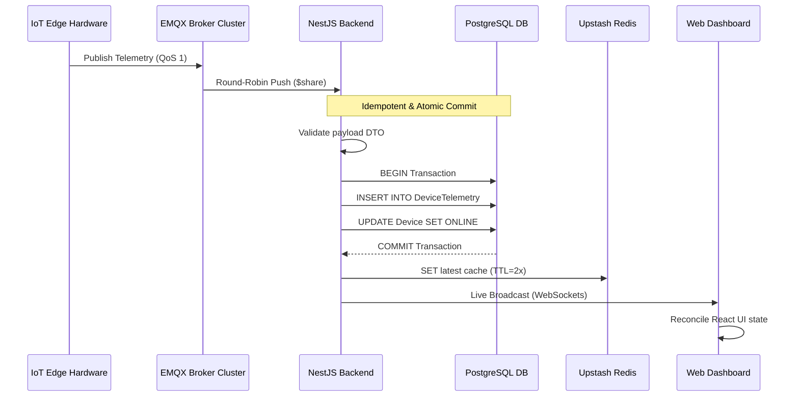
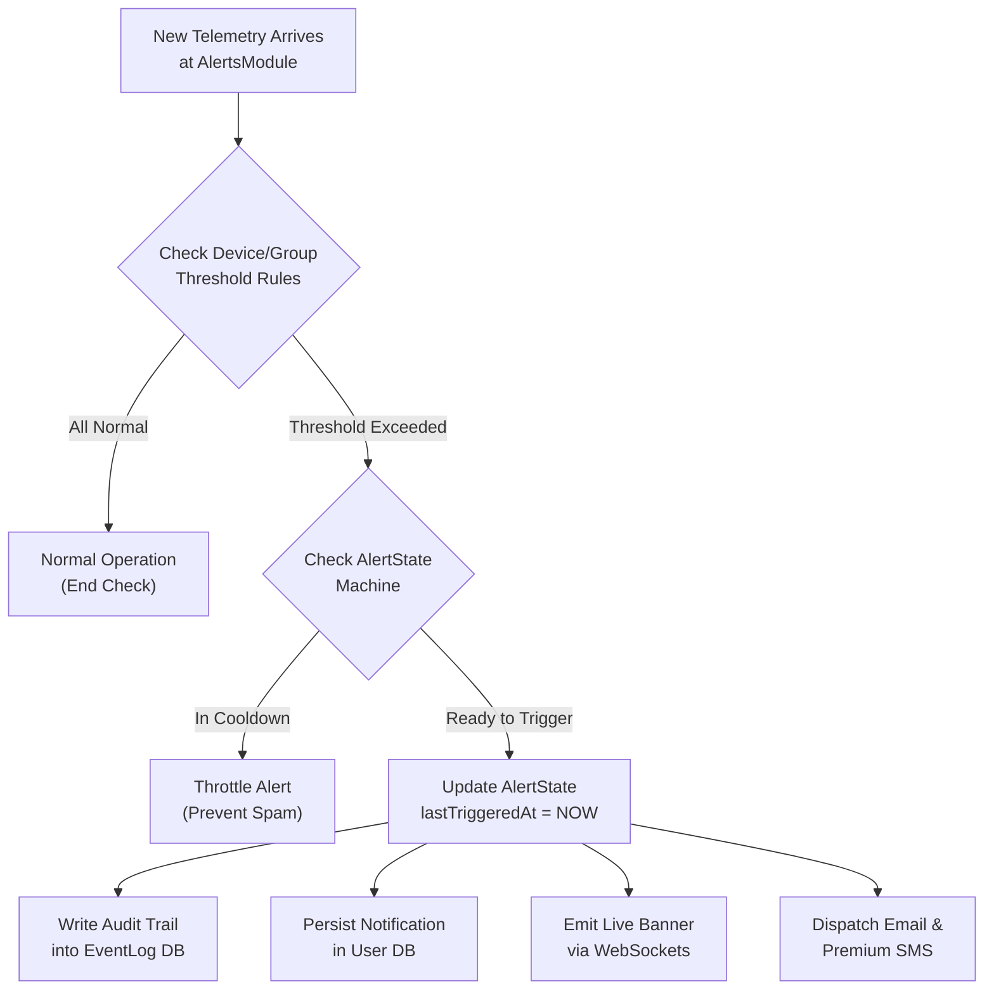
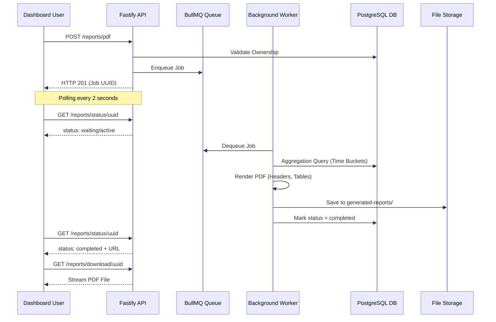
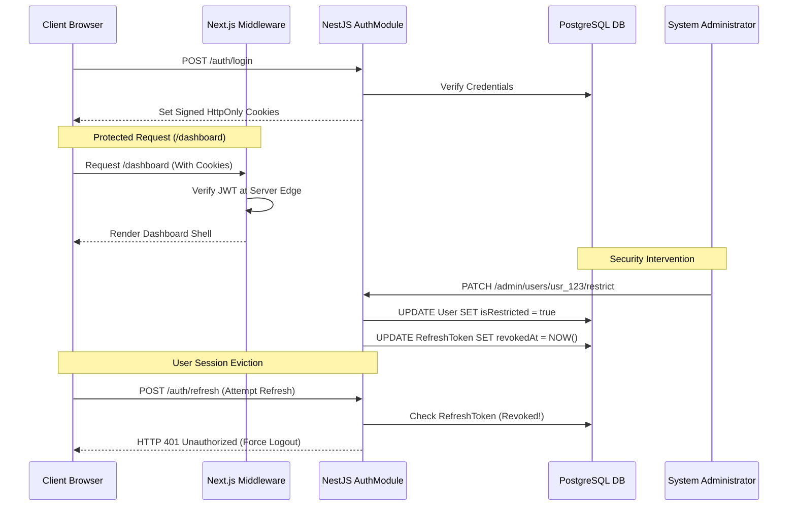
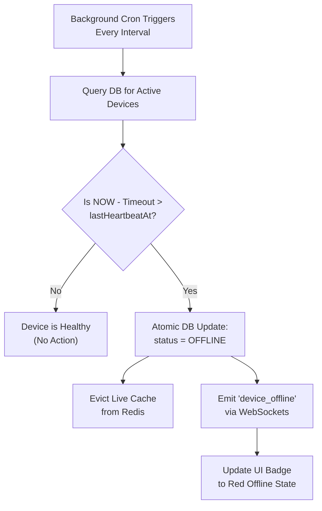

# GBI Air Quality Monitor IoT Platform – Detailed Operational Workflows

This document outlines the step-by-step operational workflows and data lifecycles that power the GBI Air Quality Monitoring platform. It is designed to guide non-technical stakeholders through end-to-end user journeys while providing precise execution steps for backend engineers, frontend developers, and system administrators.

---

## 1. Document Overview & Purpose

An enterprise IoT platform is a living system where millions of data points move continuously between hardware, message brokers, processing clusters, and browser screens. This document breaks down that continuous activity into seven core operational workflows:

1. **End-to-End Telemetry Ingestion Pipeline:** From physical air sampling to live browser visualization.
2. **Automated Alerting & Notification Lifecycle:** How safety breaches trigger instant mobile alerts and warning emails.
3. **Asynchronous Branded Report Generation:** Step-by-step execution of custom PDF and CSV report downloads.
4. **Hardware Onboarding & Lifecycle Management:** How devices are registered, assigned, monitored, and decommissioned.
5. **Secure Authentication & Session Governance:** How users log in, manage tokens, and how admins enforce bans.
6. **Premium Monetization & Subscription Upgrade Flow:** The journey from a free account to unlocked premium capabilities.
7. **Stateless Device Heartbeat & Liveness Evaluation:** How the system automatedly detects when hardware loses power.

```
+-------------------------------------------------------------------------------+
|                      GBI AIR QUALITY PLATFORM WORKFLOWS                       |
+-------------------------------------------------------------------------------+
|  [Hardware Edge] ---> [Ingestion Plane] ---> [Processing API] ---> [Client UI]|
|         |                     |                     |                     |
|    (Air Sampling)       (Shared MQTT)      (Atomic Postgres)    (Glassmorphic)|
+-------------------------------------------------------------------------------+
```

---

## 2. End-to-End Telemetry Ingestion Pipeline

This workflow describes the exact journey of a single environmental reading as it travels from physical hardware in a living room to a user's web dashboard across the globe.



### Step-by-Step Execution
1. **Hardware Sampling & Packet Creation:** The IoT hardware samples physical air sensors (PM2.5, CO2, VOCs, Temperature, Humidity). It constructs a JSON packet containing a unique cryptographic `messageId` and current timestamp.
2. **Secure MQTT Publication:** The hardware connects over SSL/TLS (port 8883) to the EMQX Broker Cluster and publishes the packet to topic `telemetry/GBI-DEV-001` using Quality of Service 1 (guaranteeing delivery).
3. **Shared Subscription Round-Robin:** The EMQX broker catches the packet. Because our backend nodes subscribe using a shared queue (`$share/gbi_backend/telemetry`), EMQX routes this exact packet to exactly one active NestJS backend server, ensuring optimal load distribution.
4. **Idempotent Transactional Ingestion:** 
   - The backend `MqttConsumer` receives the packet and runs strict DTO validation.
   - It attempts to insert the telemetry and update the parent device's status and `lastHeartbeatAt` inside an atomic `prisma.$transaction`.
   - *Duplicate Shield:* If network lag caused the broker to redeliver the packet, PostgreSQL's composite unique index (`[deviceId, messageId, timestamp]`) triggers a `P2002` error. The consumer catches this, silently drops the duplicate, and halts further execution.
5. **Real-Time State Serialization:** Once the transaction commits successfully, the backend serializes the exact JSON payload and stores it in Redis under key `device:GBI-DEV-001:latest` with a dynamic TTL set to twice the offline cutoff window.
6. **Live Dashboard Broadcast:** Simultaneously, the `RealtimeModule` pushes the telemetry packet over WebSockets or Server-Sent Events (SSE) directly to the authenticated user's open dashboard.
7. **Client UI Reconciliation:** The Next.js dashboard receives the live socket packet. React reconciles the state, triggering subtle micro-animations on the memoized metric cards (e.g., updating a rising CO2 trend arrow) without causing full-page re-renders.

---

## 3. Automated Alerting & Notification Lifecycle

When a sensor detects that air quality has crossed safe operating boundaries (e.g., CO2 rising above 1,500 ppm in a conference room), the system executes an automated safety protocol.



### Step-by-Step Execution
1. **Trigger Evaluation:** Incoming telemetry is passed directly to the `AlertsModule`. The engine fetches the user's customized JSON threshold schemas (`DeviceThreshold` or `GroupThreshold`).
2. **Rule Comparison:** The module compares current metrics against configured condition operators (e.g., `co2 > 1000 ppm`). If all metrics are within normal ranges, processing concludes immediately.
3. **State Machine Throttling (`AlertState`):** If a breach is detected, the engine queries `AlertState`.
   - If an alert was already triggered for this parameter recently and is still inside its mandatory cooldown window (e.g., 30 minutes), the system suppresses redundant notifications to prevent spamming the user.
   - If the alert is new or past its cooldown, `lastTriggeredAt` is updated to current server time.
4. **Audit Logging:** An immutable audit record is committed to the `EventLog` table, documenting the specific device ID, parameter, breached value, and exact timestamp.
5. **Multi-Channel Dispatch:**
   - **In-App:** A notification entry is saved to the database (`isRead = false`).
   - **WebSockets:** An emergency alert packet is broadcast to the frontend, instantly sliding down a red warning banner on the user's dashboard.
   - **Email & Premium SMS:** The system connects to SendGrid to dispatch an urgent safety warning email. For Premium tier accounts, a high-priority SMS or WhatsApp notification is triggered via integrated messaging gateways.

---

## 4. Asynchronous Branded Report Generation

Generating high-resolution, long-duration analytical reports (like 30 days of 5-minute air quality averages across multiple office floors) requires intensive database aggregation and CPU rendering. The system processes these requests asynchronously to maintain snappy API performance.



### Step-by-Step Execution
1. **Report Request:** The user configures a custom report on the frontend (selecting devices, parameters like PM2.5 and CO2, date ranges, and aggregation intervals such as 15 minutes). The client submits `POST /reports/pdf`.
2. **Ownership Validation & Enqueueing:** The `ReportsController` validates that the requesting user securely owns all specified devices. It creates a record in `GeneratedReport` (with a 24-hour cleanup expiration), pushes a job into the BullMQ `reports` queue, and immediately returns HTTP 201 with the generated `jobId`.
3. **Frontend Status Polling:** The user's browser transitions to a loading state with a progress indicator, polling `GET /reports/status/:jobId` every 2 seconds.
4. **Background Data Aggregation:** A dedicated background `ReportsProcessor` worker picks up the job. It executes an advanced, time-bucketed SQL query against PostgreSQL, grouping raw historical telemetry into structured time intervals and calculating exact mathematical averages for each bucket.
5. **PDF Construction & Branding (`PdfService`):**
   - The worker initializes PDFKit. It draws a professional GBI company header, report title, and generation timestamp.
   - It embeds a low-opacity GBI watermark logo centered across all pages.
   - It constructs a clean, bordered data table, iterating through time buckets and formatting cells with correct units (`µg/m³`, `ppm`, `°C`).
   - It dynamically computes page breaks and appends professional footers with page numbering.
6. **Persistence & Completion:** The rendered PDF buffer is written to secure storage (`generated-reports/`). The database status is updated to `completed`, recording the relative file path.
7. **One-Click Streamed Download:** On the next polling cycle, the frontend receives `status: "completed"` along with a secure download URL. The browser executes a redirect to `GET /reports/download/:jobId`. The backend sets `Content-Type: application/pdf` and streams the file directly to the user's hard drive.

---

## 5. Hardware Onboarding & Lifecycle Management

Physical devices progress through a strict lifecycle from factory registration to active user assignment and eventual decommissioning.

```
+-------------------------------------------------------------------------------+
|                        DEVICE LIFECYCLE STATE MACHINE                         |
+-------------------------------------------------------------------------------+
|  [Factory Stock] ---> [Admin Registered] ---> [User Claimed / Assigned]       |
|                             |                           |                     |
|                      (Bulk Excel Import)      (Active Heartbeat Streaming)    |
|                                                         |                     |
|  [Decommissioned / Soft Deleted] <--- [Unassigned] <----+ (Missed Heartbeats) |
+-------------------------------------------------------------------------------+
```

### Step-by-Step Execution
1. **Admin Bulk Registration:** System administrators navigate to the Admin Portal and upload an Excel spreadsheet (`.xlsx`) containing hundreds of factory serial numbers via `POST /admin/devices/bulk`. The backend parses the file, skips duplicates, and inserts records into `Device` with `status = OFFLINE`.
2. **Physical Installation & Pairing:** The physical device is mounted in a building and powered on. It connects to the Wi-Fi network and establishes its secure MQTT connection.
3. **User Claiming:** The customer logs into their dashboard, clicks "Add Device," and inputs the unique serial number. The system creates a `DeviceAssignment` and `UserDevice` record, linking the hardware to the user's account with a custom nickname (e.g., "Conference Room B").
4. **Active Operation:** The device begins transmitting telemetry. The ingestion engine updates its state to `ACTIVE` upon receiving non-null sensor readings.
5. **Decommissioning & Soft Deletion:** When a building lease ends or hardware is upgraded, the admin executes `POST /admin/devices/:id/unassign` or `PATCH /admin/devices/:deviceId/delete`. The device is marked `isDeleted = true`. The MQTT consumer instantly ignores any further transmissions from this serial number.

---

## 6. Secure Authentication & Session Governance

To protect sensitive IoT data and prevent unauthorized administrative access, the platform enforces rigorous session governance.



### Step-by-Step Execution
1. **Secure Authentication:** The user logs in via email/password or Google OAuth. The `AuthModule` verifies credentials and generates a short-lived Access JWT (15 mins) and a long-lived Refresh JWT (7 days).
2. **HttpOnly Cookie Transmission:** Instead of sending tokens in raw JSON to be stored in vulnerable `localStorage` (where malicious scripts could steal them), the backend sets secure, signed, `HttpOnly` cookies.
3. **Edge Route Protection (`middleware.ts`):** When the user navigates to `/dashboard`, Next.js Middleware intercepts the request on the server before transmitting page bundles. It cryptographically validates the cookie. If valid, the page renders perfectly; if missing or expired, the middleware instantly redirects to `/login`.
4. **Automated Token Rotation:** When the 15-minute access token expires, the client calls `/auth/refresh`. The backend validates the refresh token in PostgreSQL, issues a fresh token pair, and rotates the old refresh token to prevent replay attacks.
5. **Instant Admin Restriction Execution:** If a user account is flagged for suspicious activity, an administrator clicks "Ban User" on the Admin Hub (`PATCH /admin/users/:id/restrict`).
   - PostgreSQL flags `isRestricted = true` and instantly stamps `revokedAt = NOW()` across all active refresh tokens for that user ID.
   - When the user's access token expires minutes later and their browser attempts to refresh, the backend detects the revocation, returns `401 Unauthorized`, clears all browser cookies, and forcibly ejects the user to the login screen.

---

## 7. Premium Monetization & Subscription Upgrade Flow

The platform offers a seamless upgrade path from free-tier monitoring to unlocked premium enterprise capabilities.

```
+-------------------------------------------------------------------------------+
|                      PREMIUM UPGRADE LIFECYCLE WORKFLOW                       |
+-------------------------------------------------------------------------------+
| [Free Dashboard] ---> [Checkout Paywall] ---> [Webhook Verification]          |
|         |                     |                     |                         |
|   (2 Device Limit)    (Razorpay / PhonePe)    (Crypto Signature Validated)    |
|                                                     |                         |
| [Unlocked Features] <--- [Database Updated] <-------+                         |
| (PDFs, Unlimited Devices, High-Speed Queues)                                  |
+-------------------------------------------------------------------------------+
```

### Step-by-Step Execution
1. **Paywall Encounter:** A free-tier user attempts to add a 3rd IoT device or click "Generate Branded PDF." A sleek glassmorphic modal appears explaining the benefits of Premium access.
2. **Secure Payment Gateway Checkout:** The user selects an annual subscription and clicks "Upgrade." The frontend initializes the **Razorpay or PhonePe** checkout interface. The user securely completes the transaction using UPI, credit card, or net banking.
3. **Cryptographic Webhook Verification:** The payment gateway fires an asynchronous webhook back to the backend (`POST /subscriptions/webhook`). The NestJS server computes an HMAC SHA256 cryptographic signature to verify invoice authenticity, preventing fraudulent transactions.
4. **Subscription Activation:** The backend inserts an active record into `Subscription` and `PremiumSubscription`, setting the user's `isPremium = true` and stamping `premiumExpiry = NOW() + 365 Days`. An audit log is committed to `PremiumHistory`.
5. **Instant Feature Unlocking:** The next time the user's browser polls or navigates, their upgraded token context unlocks premium dashboard features. They can now onboard unlimited hardware, access 1-year data archives, utilize priority PDF report queues, and configure WhatsApp emergency alerts.

---

## 8. Stateless Device Heartbeat & Liveness Evaluation

This workflow details how the backend cluster automatedly detects when physical hardware in a remote warehouse suffers a power outage or network failure.



### Step-by-Step Execution
1. **Stateless Scheduler Execution:** Every few minutes, a precision background cron job (`@nestjs/schedule`) awakens inside the backend cluster.
2. **Database Liveness Query:** Because tracking memory timers inside individual servers fails in a load-balanced cluster, the cron queries the singular source of truth: PostgreSQL `Device.lastHeartbeatAt`.
3. **Cutoff Evaluation:** The cron calculates the maximum allowable silence window: `OfflineCutoff = IntervalSeconds * ThresholdMisses`. It evaluates: `WHERE NOW() - OfflineCutoff > lastHeartbeatAt AND status != 'OFFLINE'`.
4. **Atomic State Mutation:** For all matching orphaned devices, PostgreSQL executes an atomic `UPDATE Device SET status = 'OFFLINE'`.
5. **Cache Eviction & Broadcast:**
   - The backend instantly deletes any stale live cache keys (`device:{id}:latest`) from Redis to ensure no client can fetch outdated telemetry.
   - Surviving backend nodes catch the status mutation and broadcast an emergency `device_offline` WebSocket packet.
6. **Dashboard UI Alert:** The user's browser catches the socket event. The device's visual status badge instantly transitions from a glowing green `ONLINE` state to a solid red `OFFLINE` indicator, and an entry is logged in the user's Event History.
