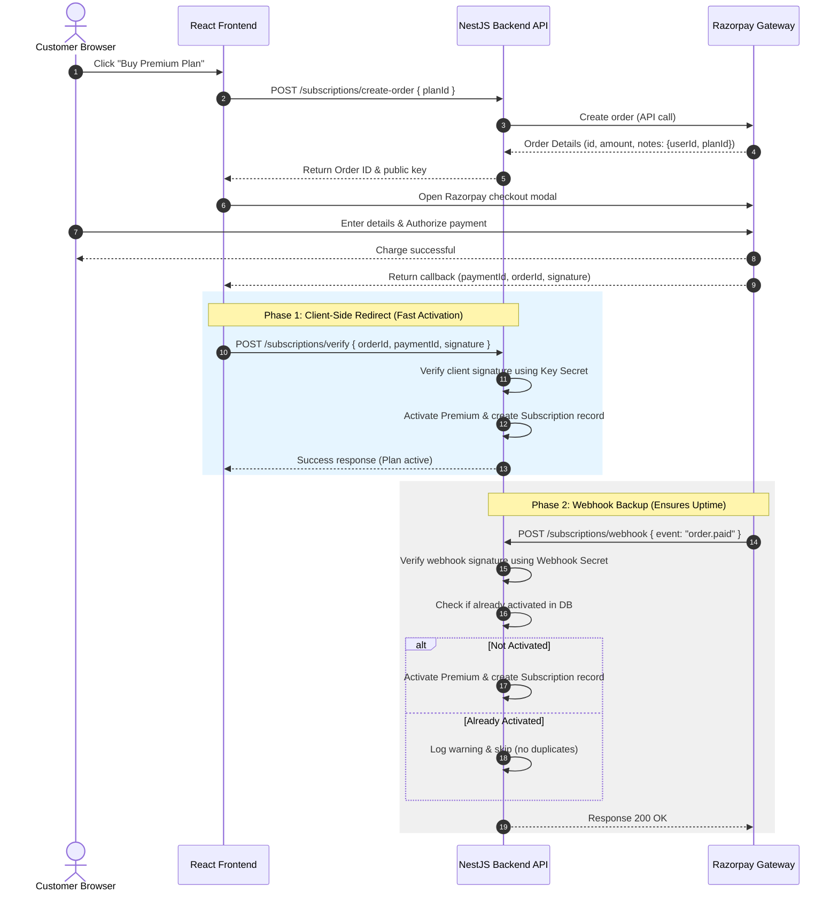

# Razorpay Integration & Webhook Configuration

This document outlines the architecture, verification mechanics, security protocols, and step-by-step setup instructions for the Razorpay payment gateway and webhook system integrated into the GBI Air Quality Monitor platform.

---

## 🔄 1. Payment Integration Flow

Our payment system uses a two-phase verification approach to ensure 100% reliability and security:



---

## 🛡️ 2. Webhook Security and rawBody Verification

### Why rawBody is Required
Razorpay signs webhook payloads using an **HMAC-SHA256 signature** based on the exact raw request body payload. If the body is modified or parsed into a JSON object by Fastify before signing verification, the resulting HMAC signature will fail.

*   **Setup**: We enabled `{ rawBody: true }` in `src/main.ts` so Fastify attaches the raw request `Buffer` to `request.rawBody`.
*   **Verification**: The signature received in the `x-razorpay-signature` header is compared cryptographically against the signature calculated on the server using `RAZORPAY_WEBHOOK_SECRET`.

---

## ⚙️ 3. Production Configuration Steps

### Step 1: Environment Variables
Ensure the following variables are configured in the production `/root/GBI-Backend/.env` file:

```env
# Razorpay Credentials
RAZORPAY_KEY_ID="rzp_live_your_live_key_id"
RAZORPAY_KEY_SECRET="your_live_key_secret"

# Webhook Secret Key (Generated Secure 256-bit Key)
RAZORPAY_WEBHOOK_SECRET="7a6a9f049cb90eca0298b8c2049da2ba2b25b0f7dc6fdf0969bcd87b5ceef914"
```

### Step 2: Register the Webhook in Razorpay Dashboard
1. Log in to the **[Razorpay Dashboard](https://dashboard.razorpay.com/)**.
2. Navigate to **Payments** -> **Settings** -> **Webhooks** tab.
3. Click **Add New Webhook**.
4. Configure the settings:
   *   **Webhook URL**: `https://api.gbiair.in/subscriptions/webhook`
   *   **Secret**: `7a6a9f049cb90eca0298b8c2049da2ba2b25b0f7dc6fdf0969bcd87b5ceef914`
   *   **Active Events**: Select **`order.paid`**.
5. Click **Create Webhook**.

---

## 🛠️ 4. Local Testing & Verification

You can simulate a Razorpay webhook event locally to test the signing and verification logic:

### Using a Test Script
Create a node script `scripts/test-webhook.js`:

```javascript
const axios = require('axios');
const crypto = require('crypto');

const secret = '7a6a9f049cb90eca0298b8c2049da2ba2b25b0f7dc6fdf0969bcd87b5ceef914';
const payload = {
  event: 'order.paid',
  payload: {
    order: {
      entity: {
        id: 'order_test_12345',
        notes: {
          userId: 'your-user-uuid-here',
          planId: 'pro'
        }
      }
    },
    payment: {
      entity: {
        id: 'pay_test_12345'
      }
    }
  }
};

const rawBody = JSON.stringify(payload);
const signature = crypto.createHmac('sha256', secret).update(rawBody).digest('hex');

axios.post('http://localhost:4000/subscriptions/webhook', rawBody, {
  headers: {
    'Content-Type': 'application/json',
    'x-razorpay-signature': signature
  }
}).then(res => console.log('Response:', res.data))
  .catch(err => console.error('Error:', err.response?.data || err.message));
```
